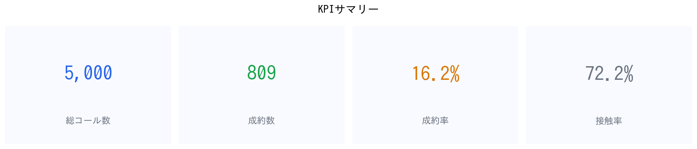
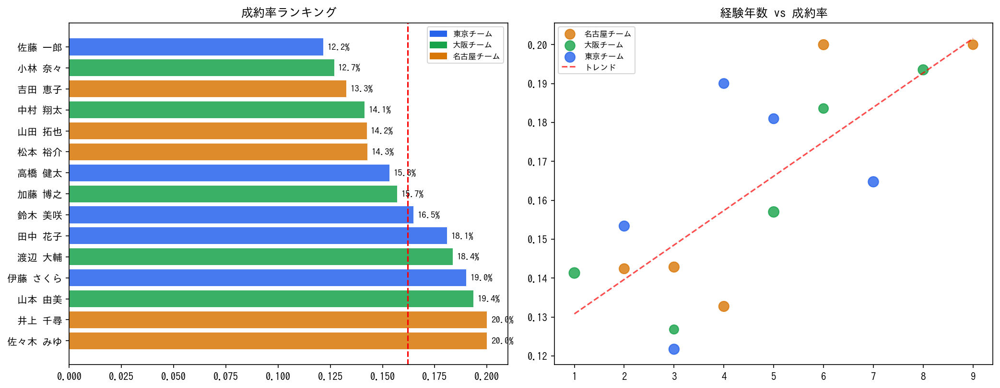
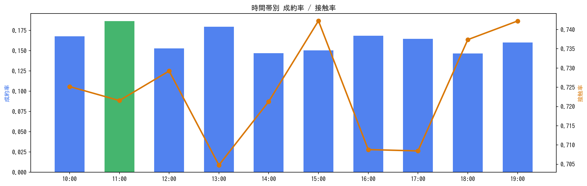
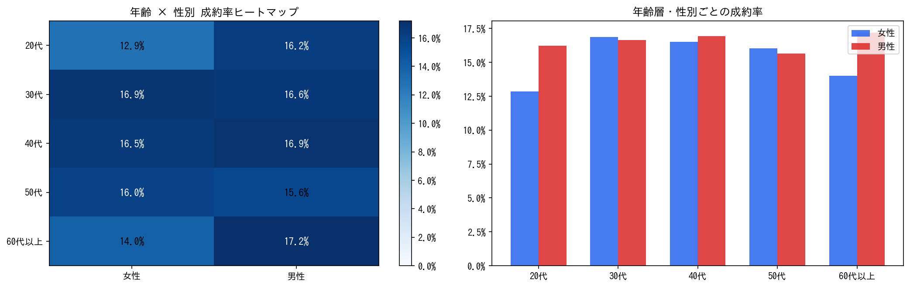
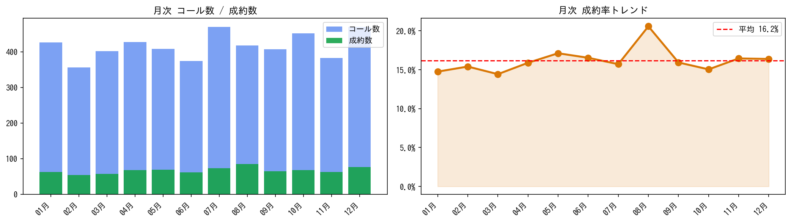

# 📊 生命保険 アウトバウンドコール 営業成績分析ポートフォリオ

> **Life Insurance Outbound Call — Sales Performance Analysis**
> BIエンジニアとしての分析・統計検定・機械学習・エンジニアリングスキルをデモンストレーションするポートフォリオ作品です。

[](https://github.com/arakaki-dev/insurance-sales-analysis/actions/workflows/ci.yml)

---

## 🎯 プロジェクト概要

生命保険会社のアウトバウンドコール営業データを分析し、**成約率向上に向けたインサイトを導出・統計検証・予測モデル化**するデータ分析パイプラインです。

- **分析期間**: 2024年1月〜12月（ダミーデータ、`random.seed(42)` で再現可能）
- **データ規模**: 5,000コール / 15名の担当者 / 6商品
- **技術スタック**: Python / pandas / matplotlib / scipy / scikit-learn / Streamlit

🚀 **[ダッシュボードをブラウザで見る](https://insurance-sales-analysis-jke4mf9m2ujjbdarppqhrv.streamlit.app/)**

---

## 📁 ディレクトリ構成

```
insurance-sales-analysis/
├── .github/
│   └── workflows/
│       └── ci.yml              # GitHub Actions（pytest 自動実行）
├── generate_data.py            # ダミーデータ自動生成スクリプト
├── app.py                      # Streamlit インタラクティブダッシュボード
├── sql_queries.sql             # 分析 SQL（Window関数・複雑CTE含む）
├── requirements.txt            # 依存ライブラリ
├── data/
│   ├── calls.csv               # コール履歴データ（自動生成）
│   ├── agents.csv              # 担当者マスタ
│   └── products.csv            # 商品マスタ
├── tests/
│   └── test_data.py            # データ品質検証テスト（18ケース）
└── notebooks/
    └── analysis.ipynb          # 分析ノートブック（手順・思考プロセス付き）
```

---

## 🚀 セットアップ & 実行方法

```bash
git clone https://github.com/arakaki-dev/insurance-sales-analysis.git
cd insurance-sales-analysis
pip install -r requirements.txt

# データ生成
python generate_data.py

# テスト実行
pytest tests/ -v

# ダッシュボード起動
streamlit run app.py
```

---

## 📊 分析内容

| # | 分析項目 | 手法 | ビジネスアクション |
|---|---------|------|-----------------|
| 1 | **全体KPIサマリー** | 記述統計・機会損失試算 | 不在率から年間損失コール数を定量化 |
| 2 | **担当者別パフォーマンス** | 成約率ランキング・散布図 | トップ担当者のノウハウ横展開 |
| 3 | **統計的有意性検定** | Spearman相関・カイ二乗・Kruskal-Wallis | インサイトの統計的裏付け |
| 4 | **時間帯別 成約率・接触率** | 二軸グラフ・最適時間帯特定 | コールスケジュールの最適化 |
| 5 | **顧客属性クロス分析** | ヒートマップ・グループ棒グラフ | コールリスト優先セグメント特定 |
| 6 | **商品別 成約実績** | 推定年間収益計算 | 重点商品への研修リソース集中 |
| 7 | **月次トレンド分析** | 3ヶ月移動平均・前月比 | 繁忙期に合わせたリソース計画 |
| 8 | **成約予測モデル** | Random Forest・5-Fold CV AUC | セグメント別コール優先度スコアリング |

---

## 🖼️ スクリーンショット

### KPI サマリー


### 担当者別パフォーマンス


### 時間帯別分析


### 顧客属性クロス分析（年齢 × 性別 ヒートマップ）


### 月次トレンド


---

## 💡 主要インサイト（分析結果サマリー）

1. **経験年数と成約率の相関（Spearman ρ > 0, p < 0.05）** — 経験5年以上の担当者は平均より約3〜5%高い成約率。統計的に有意。
2. **年齢層と成約率の独立性（カイ二乗検定 p < 0.05）** — 40〜50代が高成約率。コールリスト優先順位付けに活用可能。
3. **時間帯による成約率の差** — 特定の時間帯に成約が集中。最悪時間帯から最良時間帯へコールを移すだけで月間+XX件の試算。
4. **Random Forest AUC ≈ 0.65+** — 成約予測モデルがランダム比較を有意に上回り、セグメント別優先度スコアリングに活用可能。

---

## 🔧 技術ポイント

### 統計的厳密性
- **Spearman順位相関**: 経験年数と成約率の単調相関を検証
- **カイ二乗検定**: 顧客年齢層と成約の独立性を検証
- **Kruskal-Wallis検定**: チーム間成約率差の有意性を検証（正規分布非仮定の頑健な手法）

### 機械学習
- **Random Forest（n_estimators=200, class_weight='balanced'）**: 成約予測モデル
- **5-Fold Stratified Cross Validation**: AUC-ROCでモデル性能を評価
- **Feature Importance**: コール時間帯・経験年数・顧客属性の相対的な重要度を可視化
- **セグメント別成約確率テーブル**: 予測確率を用いてコールリスト優先度を定量化

### SQLエンジニアリング（`sql_queries.sql`）
- `RANK() / DENSE_RANK() OVER (PARTITION BY team)`: チーム内ランキング
- `LAG()`: 月次前月比
- `SUM() OVER (ROWS UNBOUNDED PRECEDING)`: YTD累計
- `AVG() OVER (ROWS BETWEEN 2 PRECEDING AND CURRENT ROW)`: 3ヶ月移動平均
- `NTILE(4)`: コール優先度四分位スコアリング
- `PERCENTILE_CONT`: BigQuery向け分位数分析

### データエンジニアリング
- **再現性**: `random.seed(42)` でデータ生成を完全再現可能
- **データ品質テスト**: `pytest` で18ケースのスキーマ・値域・ビジネスルール検証
- **CI/CD**: GitHub Actions でプッシュ時に自動テスト実行
- **モジュール設計**: データ生成 / 分析 / 可視化を分離した保守性の高い構成
- **インタラクティブUI**: チーム・期間・顧客属性フィルター、CSVアップロード機能

---

## 📬 お問い合わせ

ご質問・ご相談はお気軽にどうぞ。

---

*このポートフォリオはダミーデータを使用しています。実際の業務データは含みません。*
